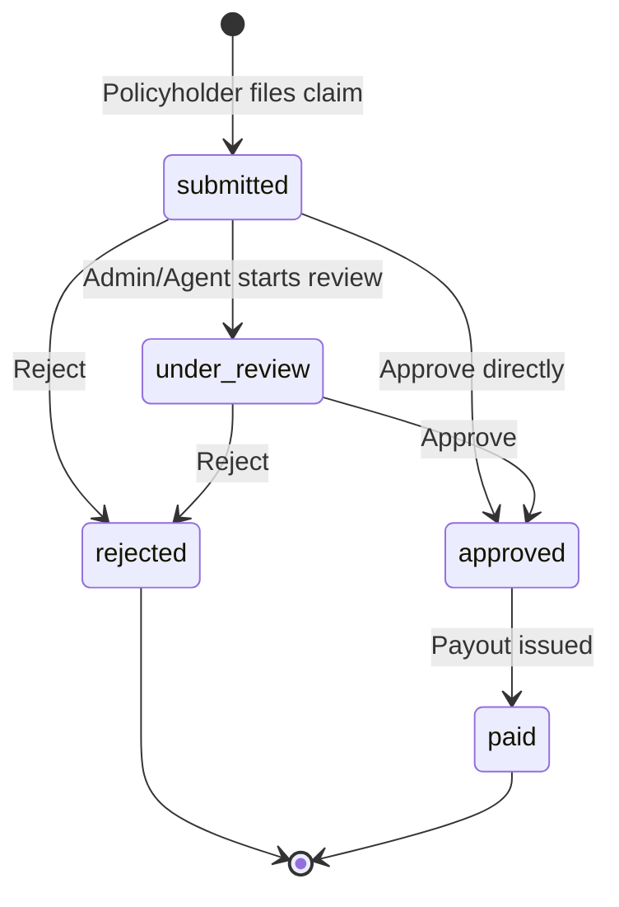
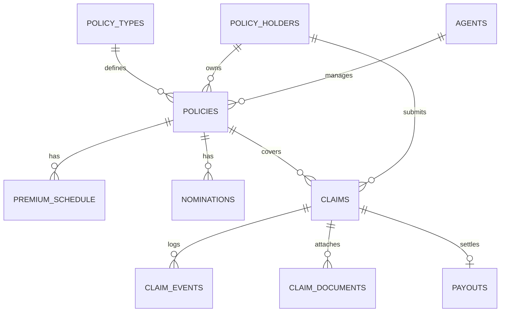

# Insure — Insurance Policy Management System

A full-stack **Flask + MySQL** web application for managing insurance policies, premium collection, and claims adjudication — built around three role-based portals: **Admin**, **Agent**, and **Policyholder**.

## Table of Contents

- [Overview](#overview)
- [Features](#features)
- [Claim Lifecycle](#claim-lifecycle)
- [Tech Stack](#tech-stack)
- [Project Structure](#project-structure)
- [Database Schema](#database-schema)
- [Getting Started](#getting-started)
- [Demo Credentials](#demo-credentials)
- [Route Reference](#route-reference)
- [Notes & Known Limitations](#notes--known-limitations)
- [Possible Improvements](#possible-improvements)

## Overview

Insure is a session-authenticated, server-rendered insurance operations platform. A single Flask app serves three distinct dashboards depending on who's logged in:

- An **Admin / Underwriter** who runs the entire book of business
- **Agents** who manage their own client portfolios and commissions
- **Policyholders** who manage their own policies and file claims

Claims move through a guarded status workflow (`submitted → under_review → approved/rejected → paid`) that Admins and Agents can adjudicate, with every transition recorded in an audit trail. The database ships pre-seeded with three sample policy types (Term Life, Health Plus, Motor Secure) and demo accounts for all three roles — see [Demo Credentials](#demo-credentials).

## Features

### 🛡️ Admin / Underwriter Portal

- Operations overview — active policies, pending claims, and premiums due at a glance
- Manage the **policy type catalogue** (coverage category, base premium, coverage limits, term limits, grace period)
- **Issue policies** to any policyholder, with the monthly premium schedule generated automatically
- Create **agent** and **policyholder** accounts, and upload profile pictures for either
- **Assign or reassign an agent** on any policy
- **Premiums ledger** — view every installment across all policies and mark installments as collected
- **Overdue premium report**, sorted by days overdue
- **Adjudicate claims** — move claims through review, approval (with payout amount), rejection, or mark as paid
- Active policy mix breakdown by policy type

### 🧑‍💼 Agent Portal

- Portfolio overview — total clients, actively managed policies, commission earned to date
- **Submit/issue policies** on behalf of a client
- Full **policy portfolio** view with client and policy status
- Per-policy **commission tracking** (rate, installments paid, commission earned so far)
- Shares the **claim adjudication** screen with Admins

### 👤 Policyholder Portal

- Dashboard — next premium due, active policy count, latest claim status
- View all issued policies, including a **coverage summary** and lapsed/blocked status
- Open a full **policy detail** page — installment history, claims filed, and nominations
- **Pay premium installments** directly
- **Submit new claims**, with the incident date validated against the policy's effective date
- Claim submission is blocked client-side with a warning if the selected policy has an installment more than 30 days overdue
- **Claims tracker** showing status and amounts requested/approved

### 🔄 Shared

- **Policy detail** page, reachable by all three roles, with server-side ownership checks for policyholders
- **Claim adjudication** with a full, timestamped audit trail (`claim_events`) recording every status change and who made it

## Claim Lifecycle

Status transitions are validated server-side in `adjudicate_save()`. Once a claim is `approved`, `rejected`, or `paid` it's locked and can no longer be re-adjudicated. Approving a claim with a payout amount creates a `payouts` record; marking it `paid` stamps the payout date.



## Tech Stack

| Layer      | Technology                                                           |
| ---------- | -------------------------------------------------------------------- |
| Backend    | Python 3, [Flask 3.1.3](https://flask.palletsprojects.com/)          |
| Database   | MySQL 8.x via `mysql-connector-python`                               |
| Templating | Jinja2                                                               |
| Frontend   | Bootstrap 5.3.8, Bootstrap Icons, vanilla JavaScript (no build step) |
| Auth       | Flask server-side sessions, role-based access control                |

## Project Structure

```
Insurance_Policy_Management/
├── app.py                           # Flask app: routes, auth, business logic (~700 lines)
├── db.py                            # MySQL connection helper
├── insurance_policy_management.sql  # Full schema + demo seed data
├── requirements.txt                 # Python dependencies
├── static/
│   ├── scripts.js                   # Premium preview, claim validation, adjudication UI logic
│   ├── styles.css                   # Custom styling on top of Bootstrap
│   └── uploads/                     # Profile pictures (auto-created at runtime, gitignored)
│       ├── agents/
│       └── policyholders/
└── templates/
    ├── login.html                   # Shared login page (role selector)
    ├── admin.html                   # Admin / underwriter dashboard
    ├── agent.html                   # Agent dashboard
    ├── policy-holder.html           # Policyholder dashboard
    ├── policy-detail.html           # Shared policy detail view
    └── adjudicate.html              # Claim adjudication screen (admin/agent)
```

## Database Schema

The schema is fully defined in [`insurance_policy_management.sql`](./insurance_policy_management.sql) — 11 InnoDB tables with foreign keys and check constraints (e.g. `annual_premium > 0`, `end_date > start_date`).



| Table              | Purpose                                                                                 |
| ------------------ | --------------------------------------------------------------------------------------- |
| `admins`           | Admin / underwriter accounts                                                            |
| `agents`           | Agent accounts, including commission rate                                               |
| `policy_holders`   | Customer accounts                                                                       |
| `policy_types`     | Product catalogue — coverage category, base premium, coverage/term limits, grace period |
| `policies`         | Issued policies, linking a policyholder, a policy type, and (optionally) an agent       |
| `premium_schedule` | Monthly installment schedule, auto-generated when a policy is issued                    |
| `claims`           | Claims filed against a policy                                                           |
| `claim_events`     | Audit trail of every claim status transition                                            |
| `claim_documents`  | Supporting documents for a claim (schema is in place; no upload route wired up yet)     |
| `nominations`      | Beneficiary nominations per policy                                                      |
| `payouts`          | Payout record created when a claim is approved                                          |

## Getting Started

### Prerequisites

- Python 3.9+
- MySQL Server 8.x
- `pip`

### 1. Get the code

```bash
git clone <repository-url>
cd Insurance_Policy_Management
```

(Or just use the folder if you already extracted it from a ZIP.)

### 2. Create a virtual environment and install dependencies

```bash
python -m venv venv
source venv/bin/activate        # Windows: venv\Scripts\activate
pip install -r requirements.txt
```

### 3. Create and seed the database

```bash
mysql -u root -p -e "CREATE DATABASE insurance_policy_management"
mysql -u root -p insurance_policy_management < insurance_policy_management.sql
```

This creates all 11 tables and loads the demo data: 1 admin, 1 agent, 4 policyholders, 3 policy types, 4 policies, and 3 sample claims.

### 4. Point the app at your database

Edit `db.py` with your own MySQL credentials:

```python
conn = m.connect(
    host='localhost',
    user='your_username',
    password='your_password',
    database='insurance_policy_management'
)
```

### 5. Run it

```bash
python app.py
```

Open **http://127.0.0.1:5000** — you'll land on the login page.

## Demo Credentials

All accounts below come pre-seeded from `insurance_policy_management.sql`. There's no public sign-up — only Admins can create Agent and Policyholder accounts (from the **People** tab).

| Role         | Username | Password   |
| ------------ | -------- | ---------- |
| Admin        | `admin`  | `admin123` |
| Agent        | `ragent` | `agent123` |
| Policyholder | `rahul`  | `rahul123` |
| Policyholder | `priya`  | `priya123` |
| Policyholder | `amit`   | `amit123`  |
| Policyholder | `neha`   | `neha123`  |

## Route Reference

<details>
<summary><strong>Public</strong></summary>

| Method | Route     | Description                                          |
| ------ | --------- | ---------------------------------------------------- |
| GET    | `/`       | Redirects to the login page                          |
| GET    | `/login`  | Login form                                           |
| POST   | `/login`  | Authenticate and start a session (redirects by role) |
| GET    | `/logout` | Clear the session                                    |

</details>

<details>
<summary><strong>Admin</strong></summary>

| Method | Route                        | Description                                            |
| ------ | ---------------------------- | ------------------------------------------------------ |
| GET    | `/admin/dashboard`           | KPIs, claims queue, premiums ledger, people management |
| POST   | `/admin/upload-picture`      | Upload a profile picture for an agent/policyholder     |
| POST   | `/admin/create-agent`        | Create a new agent account                             |
| POST   | `/admin/assign-agent`        | Assign/reassign an agent on a policy                   |
| POST   | `/admin/create-policyholder` | Create a new policyholder account                      |
| POST   | `/admin/add-policy-type`     | Add a new policy type to the catalogue                 |
| POST   | `/admin/issue-policy`        | Issue a policy and generate its premium schedule       |
| POST   | `/admin/collect-premium`     | Mark a premium installment as paid                     |

</details>

<details>
<summary><strong>Agent</strong></summary>

| Method | Route                  | Description                          |
| ------ | ---------------------- | ------------------------------------ |
| GET    | `/agent/dashboard`     | Portfolio and commission overview    |
| POST   | `/agent/submit-policy` | Issue a policy on behalf of a client |

</details>

<details>
<summary><strong>Policyholder</strong></summary>

| Method | Route                        | Description                            |
| ------ | ---------------------------- | -------------------------------------- |
| GET    | `/policyholder/dashboard`    | Policies, claims, next installment due |
| POST   | `/policyholder/submit-claim` | File a new claim                       |

</details>

<details>
<summary><strong>Shared</strong> (role-checked per request)</summary>

| Method | Route                     | Description                                            |
| ------ | ------------------------- | ------------------------------------------------------ |
| GET    | `/policy-detail?id=`      | Full policy detail — installments, claims, nominations |
| POST   | `/policy/pay-installment` | Pay a premium installment                              |
| GET    | `/adjudicate?id=`         | Claim adjudication screen (admin, agent)               |
| POST   | `/adjudicate/save`        | Apply a claim status transition                        |

</details>

## Notes & Known Limitations

This app looks to have started as a learning/demo project, so a few things are worth knowing before treating it as production-ready:

- **Plaintext passwords** — credentials are stored and compared as plain text (see the login query in `app.py`). Swap in `werkzeug.security.generate_password_hash` / `check_password_hash` before any real deployment.
- **Hardcoded secret key** — `app.secret_key` is a fixed string in `app.py`; move it to an environment variable.
- **Hardcoded DB credentials** — `db.py` connects with placeholder credentials inline; consider `python-dotenv` or OS environment variables instead.
- **No CSRF protection** on forms (e.g. Flask-WTF would add this).
- **`claim_documents` table is unused** — the schema supports claim document attachments, but no upload route exists yet.
- **`overdue` premium status isn't computed automatically** — it's only ever read, never transitioned from `pending`; seeded rows are marked `overdue` directly in the SQL dump.
- **Debug mode** — `app.run(debug=True)` should be disabled outside local development.

## Possible Improvements

- Hash passwords and move secrets/config to environment variables
- Wire up claim document uploads (`claim_documents` table already exists)
- A scheduled job (or on-request check) to flip `pending` installments to `overdue` past their due date
- Pagination for large tables (claims, premiums ledger)
- Automated tests
- A JSON/REST API layer for non-browser clients

---

No license file is currently included — add one (MIT, Apache-2.0, etc.) if you plan to share or open-source this project.
